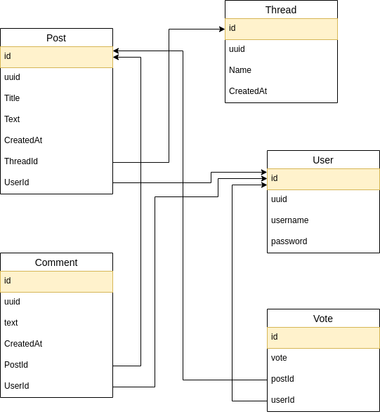

# [Readme](https://inf-git.fh-rosenheim.de/sINFalseme/php-docker-starter/-/commits/main)

## quickstart 🚀

### configuration

- everything should be ready to go as long as ports 3031 and 3030 are availiables
- you can modify settings like ports and credentials in
  - `docker-compose.yml` (&rarr; ports, db credentails)
  - `./app/.env` ( &rarr; jwt secret)
  - `./app/propel.json` (&rarr; db credentials)
  - `./client/.env` (&rarr; backend uri)
  - `client.nginx.conf` (&rarr; nginx config)
  - `php.nginx.conf` (&rarr; nginx config)

## start docker compose

```sh
docker compose up
# you must wait until composer has installed all dependencies
```

### run db migrations if needed

```sh
# if you have a fresh db exec into php docker container and run migrations
docker exec -it php-docker-starter-php-1 bash
cd /app
./vendor/bin/propel migration:up
```

## appliaction architecture

<div style="display: flex; flex-direction: row; justify-content: center;">
 
</div>

## database schema

<div style="display: flex; flex-direction: row; justify-content: center;">
 
</div>

## reference

### backend

- [composer inside docker](https://stackoverflow.com/questions/51443557/how-to-install-php-composer-inside-a-docker-container)
- [composer-allow-superuser](https://getcomposer.org/doc/03-cli.md#composer-allow-superuser)
- [composer-cant-find-mongodb-extension-required-mongodb-extension](https://stackoverflow.com/questions/54566245/composer-cant-find-mongodb-extension-required-mongodb-extension)
- [composer-in-custom-docker-image](https://dev.to/jonesrussell/install-composer-in-custom-docker-image-3f71)
- [develop php with docker](https://www.sitepoint.com/docker-php-development-environment/)
- [docker image: mariadb](https://hub.docker.com/_/mariadb)
- [docker image: nginx](https://hub.docker.com/_/nginx)
- [docker image: php](https://hub.docker.com/_/php/?tab=tags)
- [doctrine](https://github.com/doctrine/orm)~~
- [doctrine](https://www.doctrine-project.org/projects/orm.html)~~
- [getcomposer](https://getcomposer.org/download/)
- [liveregex](https://www.phpliveregex.com/)
- [mongodb](https://www.mongodb.com/docs/php-library/current/tutorial/install-php-library/)
- [php-docs](https://www.php.net/manual/en/control-structures.foreach.php)
- [php-jwt](https://github.com/firebase/php-jwt)
- [php: `error-log`](https://www.php.net/manual/en/function.error-log.php)
- [php: datetime](https://www.php.net/manual/en/datetime.gettimestamp.php)
- [phpdotenv](https://github.com/vlucas/phpdotenv)
- [phptherightway](https://phptherightway.com/)
- [propelorm: basic](http://propelorm.org/documentation/03-basic-crud.html)
- [propelorm: schema](http://propelorm.org/documentation/reference/schema.html)
- [propelorm](http://propelorm.org/)
- [Respect/Validation](https://github.com/Respect/Validation)
- [use empty()](https://nehalist.io/better-array-parameter-handling-in-php/)
- [uuid](https://github.com/ramsey/uuid)
- [wess22-musterloesung](https://inf-git.fh-rosenheim.de/b.wick/wess22-musterloesung)
- [wireframes](https://www.figma.com/file/rJgqXhmzwbCIQe8fPSpuv1/we-not-reddit?node-id=0%3A1)
- [xdebug phpstorm](https://www.jetbrains.com/help/phpstorm/configuring-xdebug.html#configuring-xdebug-vagrant)
- [xdebug vscode](https://dev.to/jackmiras/xdebug-in-vscode-with-docker-379l)
- []()

### frontend

- [date-fns](https://date-fns.org/)
- [pinia](https://pinia.vuejs.org/getting-started.html#installation)
- [router.vuejs](https://router.vuejs.org/installation.html)
- [vuejs](https://vuejs.org/api/)